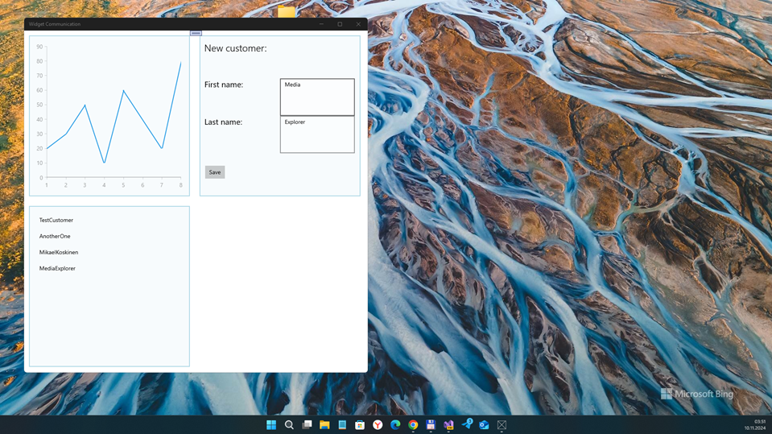

# Caliburn Micro - UWPs app samples

## About 
This is a set of samples about using Caliburn Micro in a Universal Windows app. They are a companion to a series of posts published on qmatteoq's blog http://wp.qmatteoq.com & mikael's blog https://mikaelkoskinen.net

## Screenshot(s)

## Theoretical details
Here is the full list of the posts:

- The project setup: http://wp.qmatteoq.com/using-caliburn-micro-with-universal-windows-app-the-project-setup/
- Binding and actions: http://wp.qmatteoq.com/using-caliburn-micro-with-universal-windows-app-binding-actions/
- Navigation: http://wp.qmatteoq.com/using-caliburn-micro-with-universal-windows-app-navigation/
- Messages: http://wp.qmatteoq.com/using-caliburn-micro-with-universal-windows-app-messages/
- WidgetDasboard: https://mikaelkoskinen.net/post/uwp-dashboard-widget-app-caliburn-micro
- WidgetCommunication: https://mikaelkoskinen.net/post/uwp-dashboard-widget-to-widget-communucation

## Practical details
- App type: UWP (so, all Microsoft devices family supported such as PC, XBox, Hololens, WindowsPhone)
- Project Astoria compatibility (Min. Win. OS set 10240 at now)
- Telerik for UWP used (this thing supported till December 1, 2024 ? )

## References
- https://github.com/qmatteoq Matteo Pagani aka qmatteoq (MS Developer) 
- https://github.com/qmatteoq/CaliburnMicro-UniversalApp-Demo Caliburn Micro for Windows(Phone) 8.1
- https://github.com/mikoskinen/blog UWP-WidgetDasboard & UWP-WidgetCommunication samples (Caliburn Micro + Telerik UI for UWP)

## .
As is. No support. RnD only.

##
[m][e] November, 10 2024